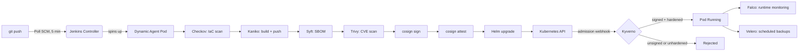

<div align="center">

# 🔐 Jenkins & Security Lab

**CI on Jenkins with dynamic Kubernetes agents → signed, SBOM'd supply chain → cluster-enforced admission control**


</div>

---

Runs entirely local on `kind` — no cloud account, no managed services.
Every image that reaches the cluster is built by this pipeline, scanned,
signed, and verified at admission time before it's allowed to run.

## Architecture



## What this demonstrates

| Concern | Tool | How |
|---|---|---|
| Dynamic CI compute | **Jenkins Kubernetes plugin** | Every run gets a fresh, ephemeral agent pod — no static build servers |
| Rootless image builds | **Kaniko** | Builds without a privileged Docker daemon, so CI itself complies with the same no-privileged policy it enforces on deploys |
| IaC scanning | **Checkov** | Scans the Helm chart before anything builds |
| SBOM | **Syft** | Full dependency inventory, generated from the pushed image |
| Vulnerability gate | **Trivy** | Fails the build on CRITICAL/HIGH CVEs |
| Image signing | **Cosign / Sigstore** | Key-based signing (no external OIDC needed for a local lab), image pinned by digest |
| Signed SBOM | **Cosign attest** | SBOM attached to the image as a signed, tamper-evident attestation |
| Admission control | **Kyverno** (Enforce) | Only images signed by this pipeline may run; containers must be non-root, non-privileged, no privilege escalation, resource limits required |
| Runtime monitoring | **Falco** | eBPF-based syscall monitoring, alerts on things like a shell spawned in a running container |
| Disaster recovery | **Velero + MinIO** | Scheduled + on-demand backups to a local S3-compatible store |
| Least-privilege CI | **RBAC** | Jenkins agents run as a dedicated `jenkins-agent` ServiceAccount, scoped to a `Role` in the `app` namespace only |

## Proving the enforcement actually works

```bash
kubectl run unsigned-test --image=nginx -n app
# Error from server: admission webhook "validate.kyverno.svc-fail" denied the
# request: failed to verify signature ...
```

Scanning alone only *reports* problems. This cluster actively *blocks* them.

## Repo layout

```
Jenkinsfile
app/                    # Go (gin) health-check service
k8s/app-chart/            # Helm chart — image pinned by digest, not tag
k8s/kyverno/                # verify-image-signature + baseline hardening policies (Enforce)
k8s/rbac/                    # jenkins-agent ServiceAccount + Role/RoleBinding
k8s/velero/                   # MinIO backend for local S3-compatible backups
k8s/falco-values.yaml           # Falco Helm values
docs/tools.md                    # what / why / command, per tool
```

## Setup

```bash
kind create cluster --config kind-config.yaml
kubectl create namespace app --dry-run=client -o yaml | kubectl apply -f -

helm repo add jenkins https://charts.jenkins.io && helm repo update
helm upgrade --install jenkins jenkins/jenkins -n jenkins --create-namespace \
  --set controller.serviceType=NodePort

kubectl create secret docker-registry regcred -n jenkins \
  --docker-server=https://index.docker.io/v1/ \
  --docker-username=<user> --docker-password=<token>

kubectl apply -f k8s/rbac/jenkins-deploy-rbac.yaml

helm repo add kyverno https://kyverno.github.io/kyverno/ && helm repo update
helm upgrade --install kyverno kyverno/kyverno -n kyverno --create-namespace
kubectl apply -f k8s/kyverno/

helm repo add falcosecurity https://falcosecurity.github.io/charts && helm repo update
helm upgrade --install falco falcosecurity/falco -n falco --create-namespace \
  -f k8s/falco-values.yaml

kubectl apply -f k8s/velero/minio.yaml
# create the `velero` bucket in MinIO first, then:
velero install --provider aws --plugins velero/velero-plugin-for-aws:v1.9.0 \
  --bucket velero --secret-file ./velero-creds --use-volume-snapshots=false \
  --backup-location-config region=minio,s3ForcePathStyle="true",s3Url=http://minio.velero.svc:9000
```

Then in Jenkins: add `cosign-private-key` (Secret file) and `cosign-password`
(Secret text) credentials, create a Pipeline job pointed at this repo's
`Jenkinsfile` via SCM, and enable Poll SCM (`H/5 * * * *`).

## Lessons learned

Most of the actual engineering time on this lab went into problems that
had nothing to do with Jenkins or the security tooling itself:

- **Tool version drift breaks CI silently.** Pulling `cosign` via `latest`
  meant a routine upstream release changed default signing behavior
  mid-project and broke a previously-working pipeline. Every tool
  (`syft`, `cosign`, `helm`) is now pinned to an explicit version.
- **A stale `k3s` install on the same host had rewritten `iptables` rules**
  that `kind` also depends on. Uninstalling it — and rebooting, not just
  restarting Docker — was required to fully clear the conflict.
- **Suspending the laptop mid-session corrupts a running `kind` cluster's**
  cached container IP vs. the IP baked into its TLS certs. The only
  reliable fix is deleting and recreating the cluster; masking
  `sleep.target`/`suspend.target` during work sessions prevents it.
- **A credential briefly landed in git history** (a local MinIO
  password, never externally reachable). Caught during review, purged
  from history with `git filter-repo`, and rotated — a good reminder
  that `git rm` alone doesn't remove anything from history.

None of this is specific to this lab — it's the real cost of running
Kubernetes nested inside Docker on a laptop, and worth knowing before
assuming a `NotReady` node means something's wrong with your YAML.